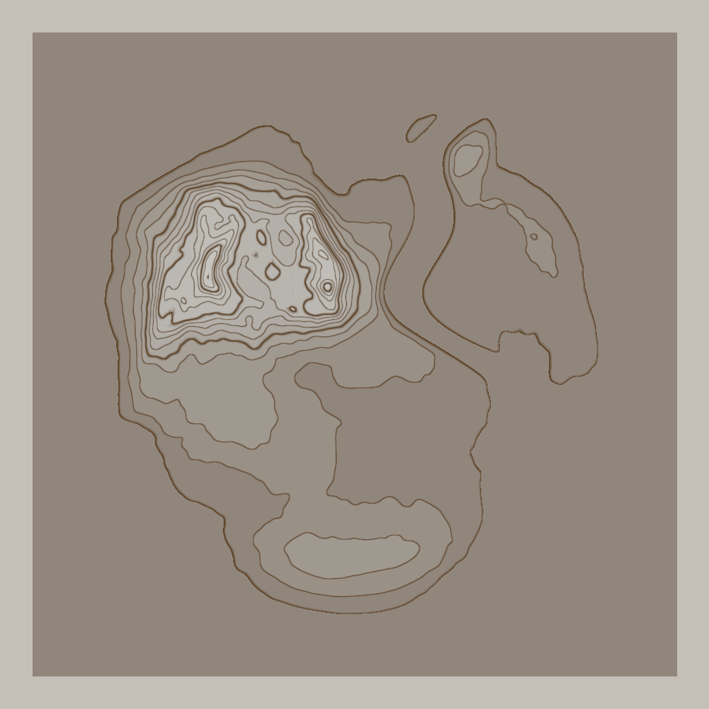
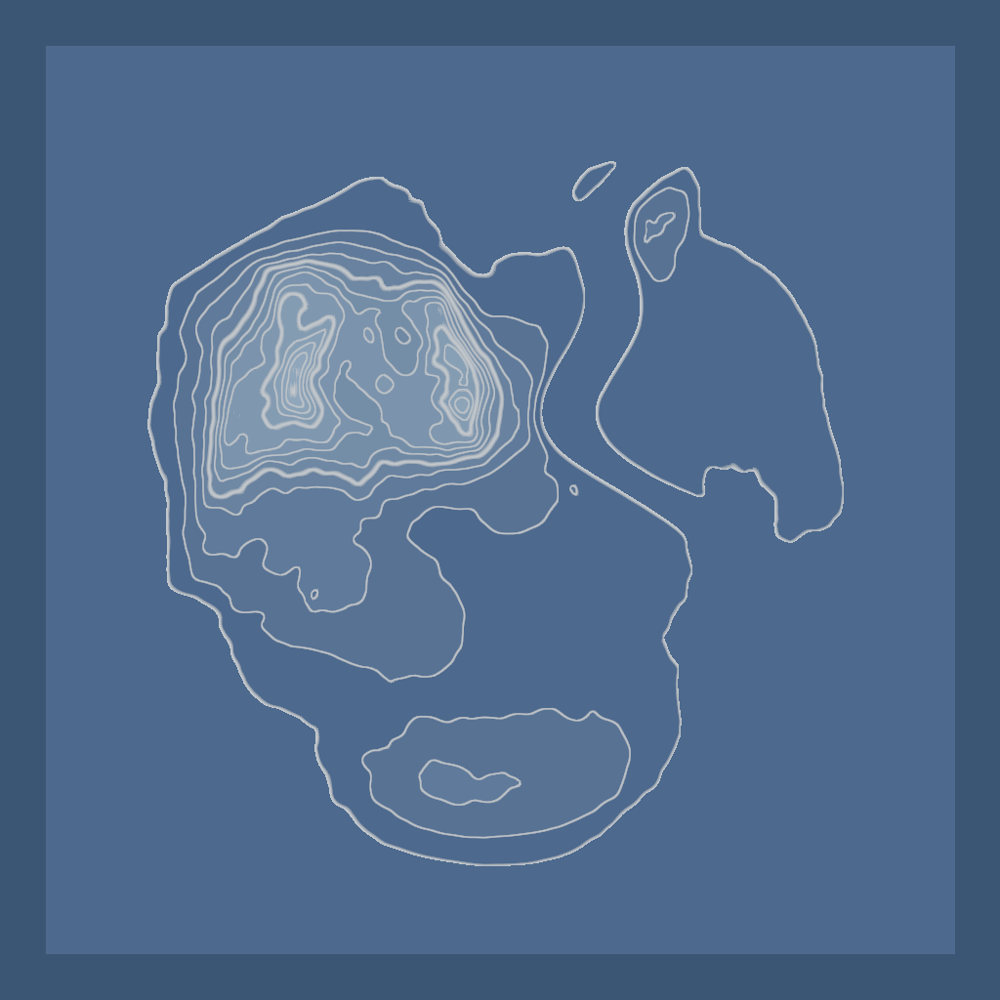
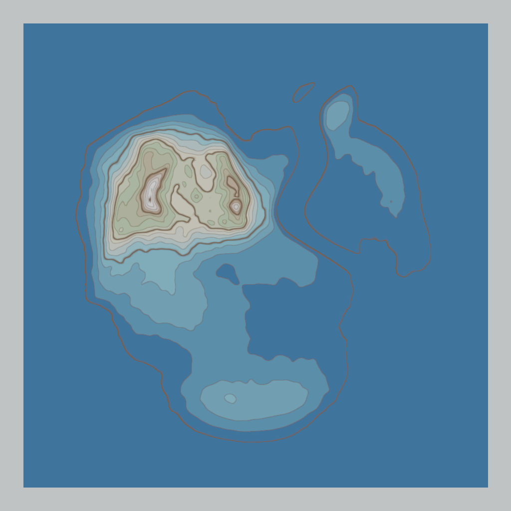
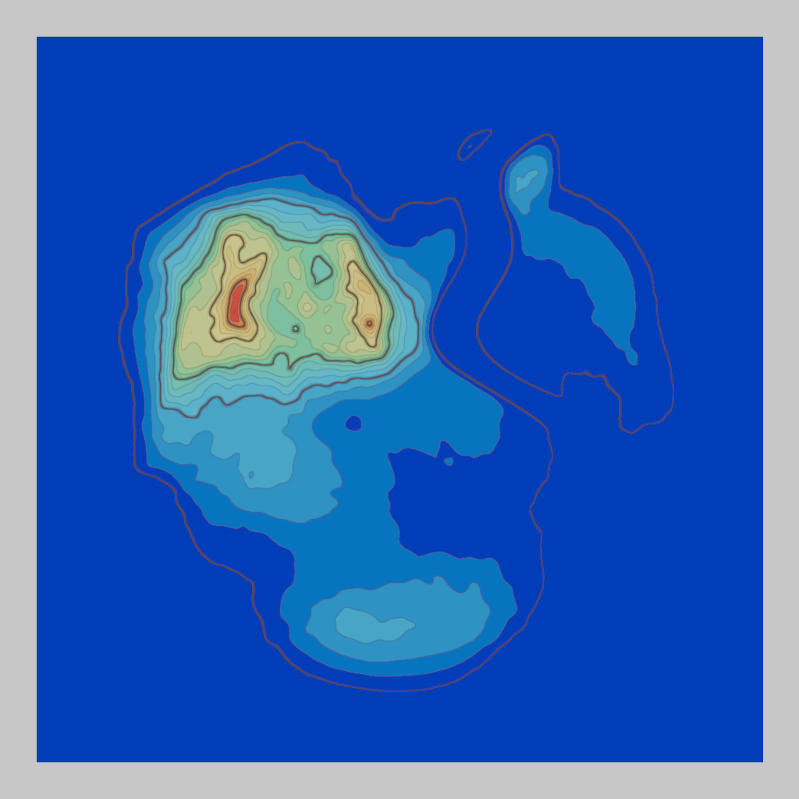

# Topographic Camera Shader (Godot 4.7+)

A depth-based topographic post-process for Godot. It recolors whatever a camera renders into a flat, stepped topographic map: elevation quantized into flat shade steps drawn from a color **gradient**, with contour lines at every step. It reads **only the depth buffer**, so the scene needs no special materials.

It is a `CompositorEffect`, so it attaches to a camera as a resource with **no extra code**. Use the ready-made camera prefab, or assign a preset to any `Camera3D` (a minimap/world-map `SubViewport` camera, or the main camera for a full-screen effect).

## Requirements

- Godot 4.7+, **.NET / C# edition** (the effect is a C# script).
- **Forward+** or **Mobile** renderer. The **Compatibility** renderer is not supported (it handles depth-texture access differently).

## Install

1. Copy the `addons/topographic/` folder into your project.
2. Build the C# solution once so `TopographicEffect` is registered.
3. Enable **Topographic Camera Shader** under **Project Settings > Plugins** (optional, but it makes the addon show up as an installed plugin).

## Use

The fastest path:

- **Drop in the prefab.** Instance `res://addons/topographic/TopographicCamera3D.tscn` into your scene. It is a `Camera3D` with the effect already assigned, so it works immediately. Position it like any camera. For a top-down map, set its **Projection** to *Orthographic* and aim it straight down.

Or assign the effect to an existing camera:

1. Select your `Camera3D` (for a minimap, the camera inside your map `SubViewport`).
2. Set its **Compositor** property to one of the presets in `res://addons/topographic/presets/` (or a duplicate, so per-camera tweaks do not affect other cameras sharing the resource).
3. Tune the look on the `TopographicEffect` inside that resource (see below).

The effect runs only when that camera renders, so it does not touch other cameras or the editor preview.

## Presets

Ready-made compositor resources in `res://addons/topographic/presets/`:

| Preset | Look |
| --- | --- |
| `classic_ink.tres` | Monochrome espresso ink on warm paper. The default. |
| `blueprint.tres` | Pale contour lines on deep navy, drafting-table style. |
| `nautical.tres` | Hypsometric sea-to-peak tints: deep blue, cyan shallows, sandy coast, green lowland, brown highland, white peaks. |
| `heatmap.tres` | Blue-green-yellow-orange-red elevation heatmap. |

| Classic Ink | Blueprint | Nautical | Heatmap |
| --- | --- | --- | --- |
|  |  |  |  |

Each is a `Compositor` holding one configured `TopographicEffect`. Duplicate one and edit its `Gradient` to make your own.

## Parameters

Edited on the `TopographicEffect` inside the compositor resource.

| Group | Property | Meaning |
| --- | --- | --- |
| Ramp | `MinElevation` / `MaxElevation` | World-Y range the ramp spans. Set these to your terrain's height range. |
| Ramp | `Levels` | Number of flat shade steps / contour lines. The main "busyness" dial. |
| Ramp | `SmoothRamp` | Continuous gradient instead of discrete steps. |
| Ramp | `InvertRamp` | Flip the color-to-elevation mapping (sample the gradient from the far end). |
| Ramp | `Gradient` | The color ramp the elevation is drawn from: left end = low, right end = high. A 2-stop gradient gives a clean monochrome look; multi-stop gradients give hypsometric tints. Edit it inline with Godot's gradient editor. |
| Contours | `ContourColor` | Color of the contour lines. Keep it distinct from the gradient bands it overlays (usually darker), or the lines wash out. |
| Contours | `ContoursEnabled` | Master toggle for all contour lines. |
| Contours | `MajorContoursEnabled`, `MajorEvery` | Bold index lines every N steps. |
| Contours | `MinorWidthPx` / `MajorWidthPx` | Line widths in pixels. |
| Contours | `MinorOpacity` / `MajorOpacity` / `MinorFade` | Line opacity and slope-based fade. |
| Background | `BackgroundColor` | Color for pixels with no geometry (empty space). |

## Notes

- The effect self-frees its GPU resources when removed at runtime. At application shutdown the rendering device may be torn down first, so the resource IDs leak then; this is harmless, the process is exiting.
- Because it reads the depth buffer, geometry must sit strictly between the camera's near and far planes (nothing touching either plane), or it reads as empty background.

## License

MIT. See `LICENSE`.
